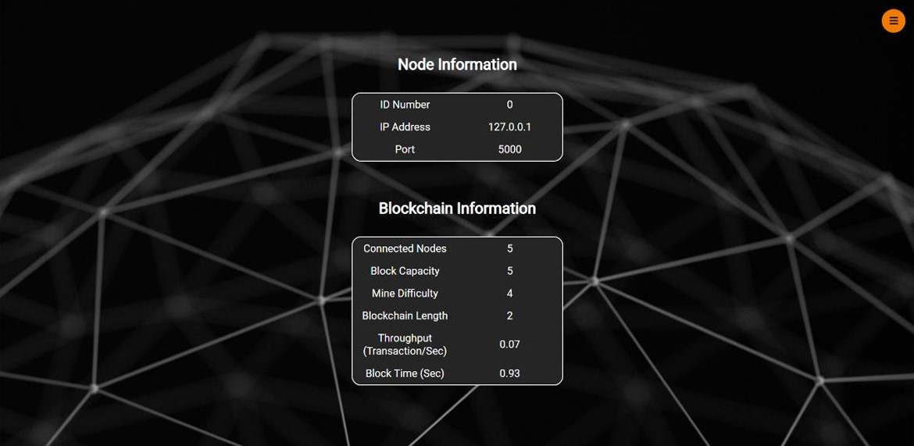
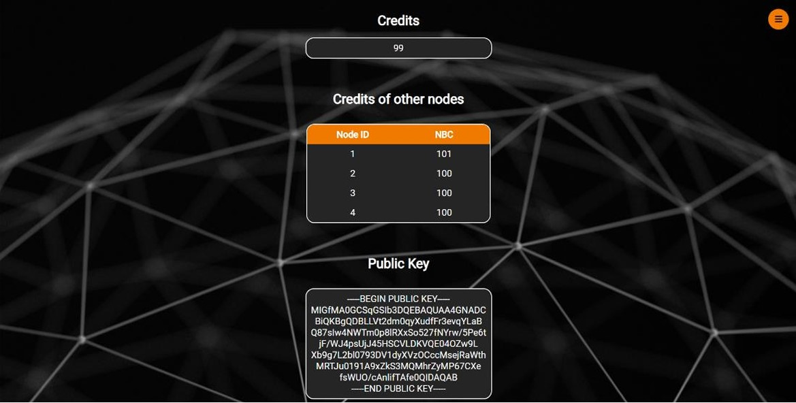
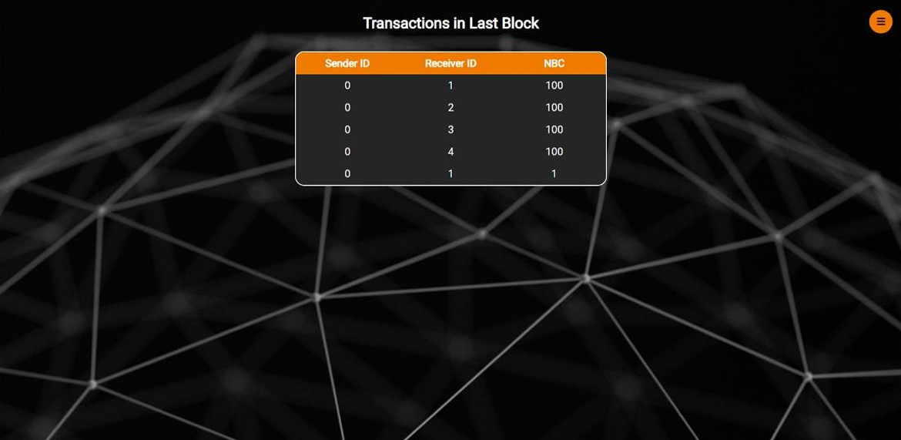
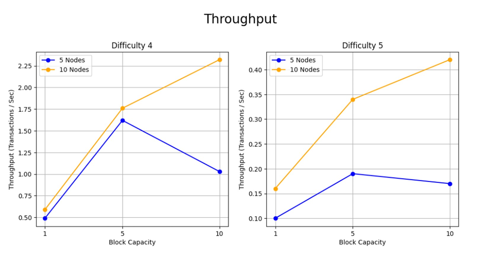
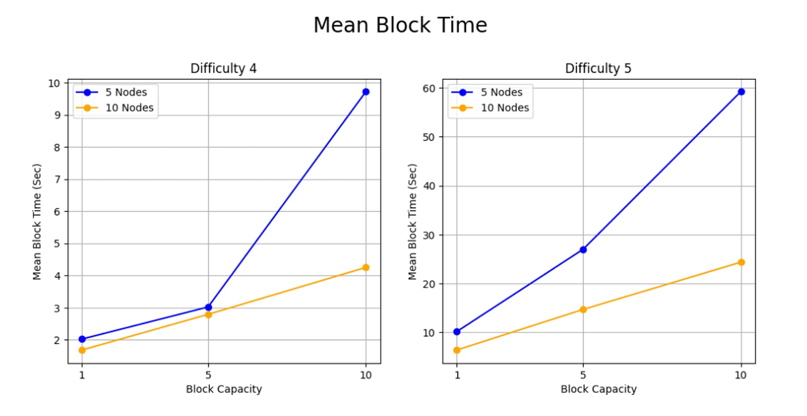

# System Design and Performance Analysis of Noobcash (BlockChain Custom Implementation)

## Introduction

This report outlines the design, implementation, and experimental evaluation of the **Noobcash system**, a simplified blockchain-based network. The system incorporates core blockchain features such as transactions, blocks, consensus mechanisms, and node communication. Additionally, the system's performance metrics are analyzed under varying configurations. The experiments explore the relationships between block capacity, mining difficulty, throughput, and mean block time across different network sizes.

---

## System Design

### Transactions
Each transaction object includes the following components:
- **Sender and Receiver Public Keys:** Identifies the parties involved in the transaction.
- **Transaction Amount:** Specifies the value being transferred.
- **UTXOs (Unspent Transaction Outputs):** Includes the UTXOs utilized and created during the transaction.
- **Digital Signature:** A SHA256-based signature ensures authenticity.
- **Timestamp:** Records the time of the transaction.
- **Genesis Block Flag:** A Boolean variable indicating if the transaction belongs to the genesis block. This prevents additional validation.

### Blocks
Each block object comprises:
- **Previous Block Hash:** Links the current block to its predecessor.
- **Transaction List:** Contains all transactions included in the block.
- **Nonce:** A variable used in the mining process.
- **Current Block Hash:** The hash representing the block's data and structure.
- **Timestamp:** Denotes the block creation time.
- **Genesis Block Flag:** Indicates whether the block is the genesis block, reducing unnecessary validation.
- **Block Size Variable:** Tracks the block's size and is used for calculating metrics.

### Blockchain
The blockchain is structured as a sequential list of verified blocks.

### Consensus Mechanism
The consensus process begins when a node receives a block whose `previous_hash` does not match the hash of its last block. The goal is to synchronize all nodes to a unified chain structure, avoiding forks.

The **Ring Algorithm** is employed:
1. The initiating node sends a token to the next node in the ring. 
2. The token includes:
   - ID of the initiating node.
   - ID of the node with the longest chain.
   - Length of the longest chain.
3. Each receiving node updates the token and forwards it.
4. In case of chains with equal length, the node with the smaller ID prevails.
5. If the initiating node detects a token with a different initiator ID, the token with the smaller ID is retained.
6. Once the token returns to the initiator, the consensus winner is broadcast, sharing its chain with all nodes.
7. Nodes validate only the blocks different from their existing chain.

### Validation Mechanism
Snapshots of verified states are maintained to:
- Validate new blocks effectively.
- Revert to a previous valid state if validation fails.

### Node Communication
Node communication is facilitated through a local Python Flask server:
- The server handles requests via dedicated buffers for:
  - Received transactions.
  - Received blocks.
  - Transaction creation requests.
  - Received consensus tokens.
- Flask Endpoints are used for data exchange.
- Buffers are processed by prioritized threads.

### Frontend Implementation
The frontend is built using **HTML, CSS, and Jinja** and consists of four pages:
1. **Navigation Menu**

    

2. **Home:** Displays general node and blockchain information.

    

3. **Wallet:** Shows balances for all nodes and the public key of the current user.

    

4. **View:** Lists transactions from the latest verified block.

    

5. **Send:** Facilitates the transfer of NBCs between nodes.

    

---

## Experimental Metrics

### 5 Nodes

**Throughput**
| Block Capacity | Difficulty 4 | Difficulty 5 |
|----------------|--------------|--------------|
| 1              | 0.49         | 0.10         |
| 5              | 1.62         | 0.19         |
| 10             | 1.03         | 0.17         |

**Mean Block Time**
| Block Capacity | Difficulty 4 | Difficulty 5 |
|----------------|--------------|--------------|
| 1              | 2.02 sec     | 10.18 sec    |
| 5              | 3.02 sec     | 26.98 sec    |
| 10             | 9.72 sec     | 59.20 sec    |

### 10 Nodes

**Throughput**
| Block Capacity | Difficulty 4 | Difficulty 5 |
|----------------|--------------|--------------|
| 1              | 0.59         | 0.16         |
| 5              | 1.76         | 0.34         |
| 10             | 2.32         | 0.42         |

**Mean Block Time**
| Block Capacity | Difficulty 4 | Difficulty 5 |
|----------------|--------------|--------------|
| 1              | 1.68 sec     | 6.41 sec     |
| 5              | 2.79 sec     | 14.70 sec    |
| 10             | 4.25 sec     | 24.35 sec    |

---

## Observations
- **Mean Block Time:** Increases with block capacity due to the longer time required to gather sufficient transactions.
- **Throughput:** Varies based on the number of nodes:
  - For 10 nodes, throughput increases gradually with block capacity.
  - For 5 nodes, the optimal throughput occurs at a block capacity of 5.

  

- **Impact of Difficulty:** Higher difficulty reduces performance:
  - Mean Block Time increases.
  - Throughput decreases due to the additional time required for mining.

    

